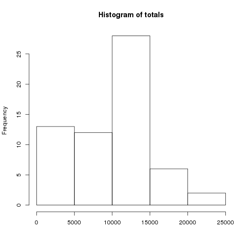
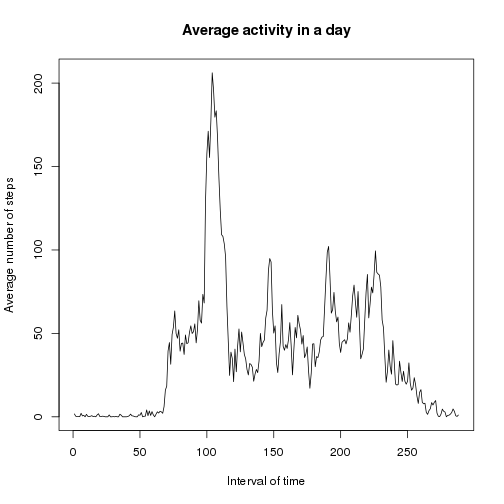
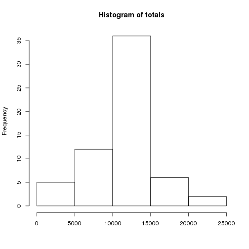
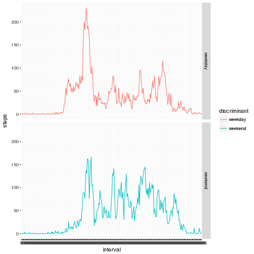

# Reproducible Research: Peer Assessment 1

## Loading and preprocessing the data

In case it hasn't been done already, we unzip the archive. We then read the file
into the variable *data*.


```r
if(!file.exists("a")) unzip("activity.zip")
data <- read.csv("activity.csv", colClasses = c("numeric", "Date", "numeric"))
```

## What is mean total number of steps taken per day?

First, we compute a list of the total number of steps per day. You can see the
**mean** and the **median** in the following:


```r
totals <- sapply(split(data, data$date), function(d) { sum(d$steps, na.rm = TRUE) })
summary(totals)
```

```
##    Min. 1st Qu.  Median    Mean 3rd Qu.    Max. 
##       0    6778   10400    9354   12810   21190
```

Let's plot a histogram of the totals:


```r
hist(totals, xlab = "")
```



## What is the average daily activity pattern?

Here is a plot of the average number of steps per interval of time across all
the days.


```r
means <- sapply(split(data, data$interval), function(d) { mean(d$steps, na.rm = TRUE) })
meansdf <- as.data.frame(as.table(means))
names(meansdf) <- c("interval", "average steps")
meansdf[,1] <- as.numeric(meansdf[,1])
plot(meansdf, type = "l", xlab = "Interval of time", ylab = "Average number of steps", main = "Average activity in a day")
```



Let's see in which intervals s-he is the most active.


```r
head(meansdf[order(meansdf[,2], decreasing = TRUE),])
```

```
##     interval average steps
## 104      104      206.1698
## 105      105      195.9245
## 107      107      183.3962
## 106      106      179.5660
## 103      103      177.3019
## 101      101      171.1509
```

## Imputing missing values

Note that there are a number of days/intervals where there are missing values
(coded as NA). The presence of missing days may introduce bias into some
calculations or summaries of the data.

Let's see how much is missing in the dataset, i.e. the number of NAs.


```r
sum(is.na(data$steps))
```

```
## [1] 2304
```

To mitigate this issue, we'll fill those missing values with the average number
of steps for this interval which we calculated in the previous section.


```r
data.nona <- data

for(i in 1:nrow(data.nona)) {
    if(is.na(data.nona[i,"steps"]))
        data.nona[i,"steps"] <- means[as.character(data.nona[i,"interval"])]
}
```

We then redo the steps taken in the second section on this new dataset:


```r
totals <- sapply(split(data.nona, data.nona$date), function(d) { sum(d$steps) })
summary(totals)
```

```
##    Min. 1st Qu.  Median    Mean 3rd Qu.    Max. 
##      41    9819   10770   10770   12810   21190
```

```r
hist(totals, xlab = "")
```



As expected the values are now more concentrated around the mean.

## Are there differences in activity patterns between weekdays and weekends?

Finally, let's compare how this person is active during the week in contrast
with the weekend.


```r
data.nona$discriminant <- sapply(data.nona$date, function(d) {
    if(weekdays(d) %in% c("Saturday", "Sunday")) "weekend"
    else "weekday"
})
data.nona$discriminant <- factor(data.nona$discriminant)

plotdata <- sapply(split(data.nona, data.nona$discriminant), function(d) {
    sapply(split(d, d$interval), function(d2) { mean(d2$steps) })
})
plotdata <- as.data.frame(as.table(plotdata))
names(plotdata) <- c("interval", "discriminant", "steps")

library(ggplot2)
ggplot(plotdata, aes(x=interval, y=steps, group=discriminant, color=discriminant)) + facet_grid(discriminant ~ .) + geom_line()
```


